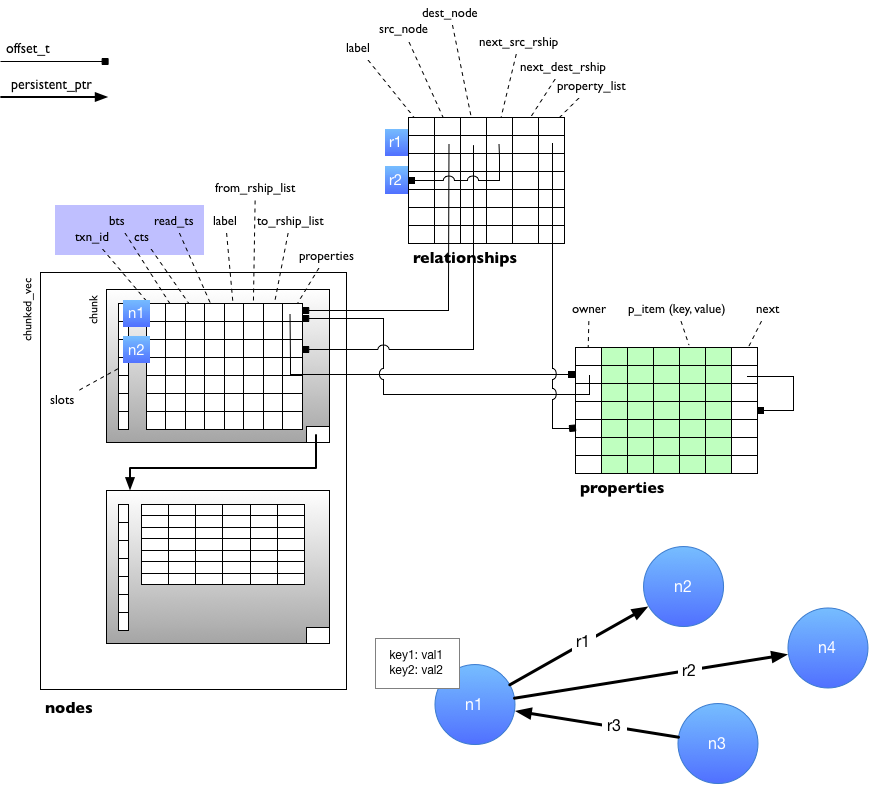
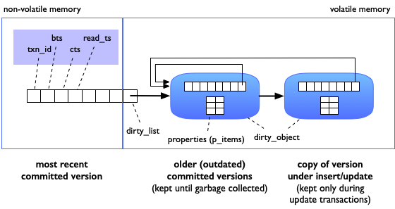

# Poseidon Graph Database

[](https://dbgit.prakinf.tu-ilmenau.de/code/poseidon_core/commits/master)
[](https://dbgit.prakinf.tu-ilmenau.de/code/poseidon_core/commits/master)

Poseidon is a graph database system for persistent memory. It uses persistent memory to store the graph data, i.e. the data is not copied between disk and memory. The data model used in Poseidon is the property graph model where nodes and relationships have labels (type names) and properties (key-value pairs). This module `poseidon_core` provides the implementation for the storage and transaction manager as well as the query execution engine.

## Installation

Simply, clone the repository, create a build directory and run the build tools `cmake` and `make`:

```bash
mkdir build; cd build
cmake ..
make

```

Make sure you have the Intel PMDK installed. If PMDK is not installed, Poseidon runs as in-memory database only.

## Using Poseidon Core

Poseidon is implemented as a C++ library `libposeidon_core` which can be used to implement applications for accessing the graph data stored in persistent memory and executing queries such as Poseidon CLI provided in a separate module.

## Querying Poseidon database

Queries - or better query plans - are directly implemented in C++ by using the `query` class. This class provides methods to construct a query plan from a set of separate operators. Poseidon provides a push-based query engine, i.e. the query plan starts with scans. The following example shows an implementation of LDBC interactive short query #1:

```c++
namespace pj = builtin;

auto q = query(gdb)
          .nodes_where("Person", "id", [&](auto &p) { return p.equal(933); })
          .from_relationships(":isLocatedIn")
          .to_node("Place")
          .project(
              {PExpr_(0, pj::string_property(res, "firstName")),
               PExpr_(0, pj::string_property(res, "lastName")),
               PExpr_(0, pj::int_to_datestring(pj::int_property(res, "birthday"))),
               PExpr_(0, pj::string_property(res, "locationIP")),
               PExpr_(0, pj::string_property(res, "browser")),
               PExpr_(2, pj::int_property(res, "id")),
               PExpr_(0, pj::string_property(res, "gender")),
               PExpr_(0, pj::int_to_datetimestring(
                   pj::int_property(res, "creationDate"))) })
          .print();
  q.start();
```

### Poseidon Python API

In addition, there is a thin wrapper library for providing a Python API. This API allows creating and opening graph databases, importing CVS data, and specifying query execution plans. The latter reflects the C++ query class (see above).

In the following Python example the database `imdb` is created by loading the IMDB data from three files.

```python
import poseidon

# create a new graph database
graph = poseidon.graph_db()
graph.create("imdb")

# we need a mapping table for mapping logical node ids to ids used for
# creating relationships
m = graph.mapping()

# import nodes and relationships for the IMDB database
n = graph.import_nodes("Movies", "imdb-data/movies.csv", m)
print(n, "movies imported.")
n = graph.import_nodes("Actor", "imdb-data/actors.csv", m)
print(n, "actors imported.")
n = graph.import_relationships("imdb-data/roles.csv", m)
print(n, "roles imported.")
```

After creating the graph database, it can be queried:

```python
q = poseidon.query(graph) \
    .all_nodes("Movies") \
    .print()

q.start()
```

## Storage structure

Poseidon stores nodes and relationships in separate persistent vectors where each vector is implemented as a chunked vector, i.e. a linked list of array of fixed size. Furthermore, properties are stored separately in a third persistent vector. Whereas for nodes and relationships each object is represented by its own record, properties belonging to the same node or relationship are stored in batches of five properties per record. Note, that strings a compressed via dictionary compression and neither stored directly in nodes, relationships, or properties.



## Transaction Processing

For transaction processing Poseidon implements a multiversion timestamp ordering (MVTO) protocol. Here, the most recent committed version is always kept in persistent memory while dirty versions (nodes/relationships which are currently inserted or updated) as well as outdated versions are stored in a dirty list in volatile memory.


